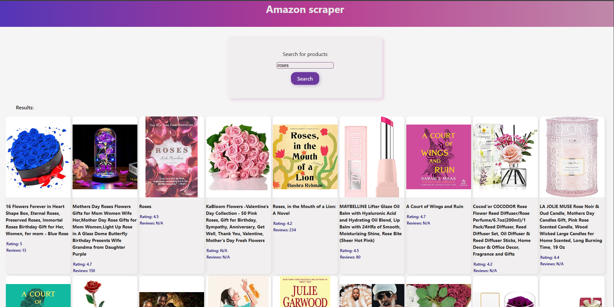

# Amazon Product Scraper

A simple fullstack project that scrapes Amazon product listings from the first page of search results based on a keyword.

## 🛠️ Tech Stack

- Bun + Express + Axios + JSDOM (Backend)
- Vite + HTML + CSS + JavaScript (Frontend)

## Preview



### Backend 📺 Frontend  

## 🥟 Bun server
bun-server/ front-end/

# 🚀 How to install
To install front and server:

open terminal and run:
```bash
npm run install:all
```
# 🚀 How to Run
```bash
npm run dev
```

The backend will be available at:

http://localhost:8080

Vite will start a development server, usually available at:

 http://localhost:5173
 

# 🔎 How It Works:
The user enters a keyword into an input field on the frontend.

When clicking "Search," the frontend sends a request to the backend API at /api/scrape?keyword=yourKeyword.

The backend uses Axios to fetch the HTML of the Amazon search results page.

JSDOM parses the HTML to extract:

Product Title

Rating (stars out of five)

Number of reviews

Product image URL

The backend returns this data as JSON.

The frontend dynamically creates and displays product cards for each result.

## 📚 Features:

Fullstack architecture (frontend + backend working together)

Web scraping using Axios and JSDOM

Dynamic creation of elements in the frontend based on fetched API data

Basic layout and styling with HTML and CSS

CORS enabled for development

## 📦 Project Structure:
The structure is as follows:

```bash
/trainee_test
  /bun_server   --> Bun backend server
  /front_end    --> Vite frontend

```